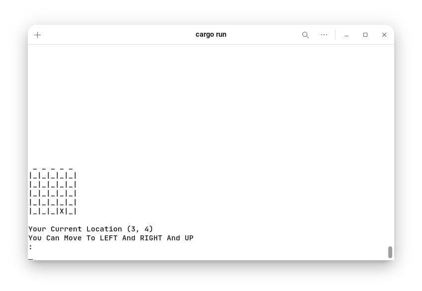

# Dungeon-Game

A Terminal Game with Rust

Welcome to Dungeon Game

For Exit The Game Write `QUIT`

In this map, a door and a monster are hidden.

To win, you must find the tile of the exit door before you reach the monster.



---

## Rust Dependencies

- crossterm = "0.21.0"
- rand = "0.8.4

---

## Run Game

```language
➜  Dungeon-Game cargo run
```

---

## Contribution

All contributions are assumed to be licensed under MIT.
